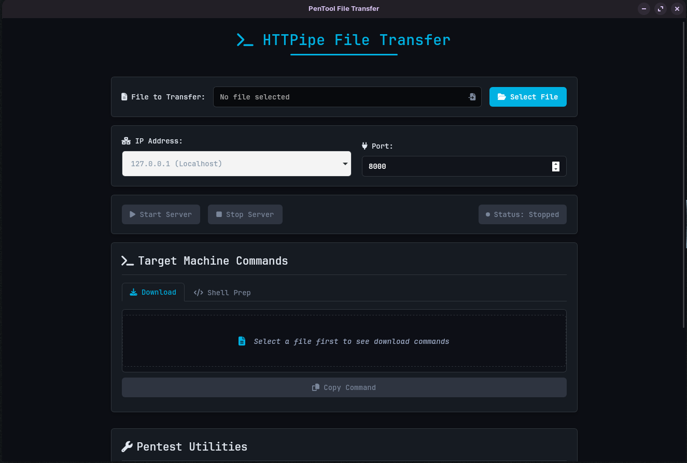

# HTTPipe

A simple cross-platform GUI tool built with Python and pywebview to quickly serve a single file over HTTP. Designed with penetration testing and local network file transfers in mind.



## Description

HTTPipe provides a straightforward graphical interface to select a file and instantly start an HTTP server on a chosen IP address and port, making that specific file available for download. It automatically generates common download commands (curl, wget, Python, PowerShell) for the target machine. Additionally, it includes handy utilities for penetration testers, such as base64 encoding/decoding commands and file chunking capabilities.

## Features

*   **Single File Server:** Serves only the selected file for security and simplicity.
*   **IP/Port Selection:** Automatically detects local IP addresses and allows custom IP/port input.
*   **Download Command Generation:** Creates ready-to-use `curl`, `wget`, `python`, and `powershell` download commands for the target machine.
*   **Shell Prep Commands:** Provides quick copy commands for upgrading limited shells (e.g., Python pty, script).
*   **File to Base64:** Encodes the selected file to Base64 and generates corresponding decode commands (`base64`, `certutil`).
*   **File Chunker:** Splits large files into smaller chunks and provides reassembly commands (`cat`, `copy /b`).
*   **Cross-Platform GUI:** Built with `pywebview` for compatibility with Windows, macOS, and Linux.
*   **Clean Interface:** Simple and intuitive UI with status indicators and notifications.

## Installation

1.  **Prerequisites:**
    *   Python 3.6+
    *   `pip` (Python package installer)
    *   **OS Dependencies:** `pywebview` relies on native web rendering engines.
        *   **Linux:** Requires `python3-gi`, `python3-gi-cairo`, `gir1.2-gtk-3.0`, `gir1.2-webkit2-4.0`. You might also need QT5 libraries (`libqt5webkit5`, `libqt5gui5`, etc.) depending on your system setup and the chosen `pywebview` backend (`qt` is specified in `requirements.txt`). Install using your package manager (e.g., `sudo apt update && sudo apt install python3-gi python3-gi-cairo gir1.2-gtk-3.0 gir1.2-webkit2-4.0 libqt5webkit5`).
        *   **macOS:** No specific OS dependencies usually required.
        *   **Windows:** No specific OS dependencies usually required.

2.  **Clone the Repository:**
    ```bash
    git clone https://github.com/reschjonas/HTTPipe
    cd HTTPipe
    ```

3.  **Install Dependencies:**
    ```bash
    pip install -r requirements.txt
    ```
    *(Consider using a virtual environment: `python3 -m venv venv`, `source venv/bin/activate` or `venv\Scripts\activate`, then `pip install ...`)*

## Usage

1.  Run the application:
    ```bash
    python3 main.py
    ```
2.  Click "Select File" to choose the file you want to share.
3.  Verify or select the desired IP address and Port.
4.  Click "Start Server".
5.  The "Target Machine Commands" section will populate with download commands. Copy the appropriate command for the target machine.
6.  Use the "Pentest Utilities" section for Base64 encoding or file splitting if needed.
7.  Click "Stop Server" when finished.

## Technologies Used

*   Python 3
*   pywebview (with QT backend)
*   HTML5
*   CSS3
*   JavaScript

## Contributing

Contributions are welcome! Please feel free to submit pull requests or open issues.


## License

This project is licensed under the MIT License - see the [LICENSE](LICENSE.md) file for details.
